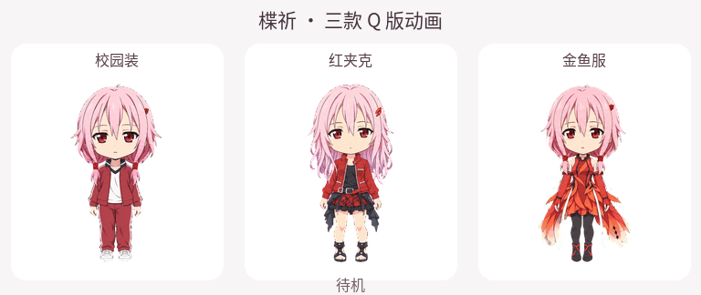

# Inori Codex Pets · 楪祈桌面宠物

五套 AI 辅助制作的非官方楪祈同人宠物，包含 Q 版与标准比例版。  
Five AI-assisted, unofficial Inori Yuzuriha fan-art companions in chibi and standard proportions.

**私有 · 未发布 / Private · Unreleased**  
本仓库已整理下载、安装、来源与分层许可文件，仍待发布前审阅。素材所涉第三方权利尚未清理，当前没有公开发布授权。  
Repository packaging and documentation are prepared for review. Third-party rights remain unresolved; public release has not been authorized.

[中文](#中文) · [English](#english) · [安装 / Install](INSTALL.md) · [素材声明 / Asset notice](ASSETS_LICENSE.md) · [发布前清单 / Release checklist](RELEASE_CHECKLIST.md)

## 中文

### 选择一套
每个 ZIP 根目录包含 `pet.json`、`spritesheet.png`、`NOTICE.txt` 和 `LICENSE.md`。以下链接供已有仓库权限者下载，不是公开发行链接。

| 版本 | 动画预览 | 独立下载 | 可查看目录 |
| --- | --- | --- | --- |
| 楪祈·金鱼服 Q 版 | [GIF](previews/inori-q-goldfish.gif) | [ZIP](packages/inori-q-goldfish.zip) | [inori-q-goldfish](pets/inori-q-goldfish/) |
| 楪祈·校园运动服 Q 版 | [GIF](previews/inori-q-school.gif) | [ZIP](packages/inori-q-school.zip) | [inori-q-school](pets/inori-q-school/) |
| 楪祈·红夹克 Q 版 | [GIF](previews/inori-q-red-jacket.gif) | [ZIP](packages/inori-q-red-jacket.zip) | [inori-q-red-jacket](pets/inori-q-red-jacket/) |
| 楪祈·校园运动服标准比例版 | [GIF](previews/inori-school.gif) | [ZIP](packages/inori-school.zip) | [inori-school](pets/inori-school/) |
| 楪祈·红夹克标准比例版 | [GIF](previews/inori-red-jacket.gif) | [ZIP](packages/inori-red-jacket.zip) | [inori-red-jacket](pets/inori-red-jacket/) |

也可下载仓库后在本地打开 [PREVIEW.html](PREVIEW.html)，一次查看五套及对比预览。页面不加载外部资源。

### 本地安装
1. 阅读 [素材使用声明](ASSETS_LICENSE.md)，选择单只 ZIP，解压到同名文件夹。
2. 在已安装的 Petdex Desktop 中，将该文件夹放到 `~/.codex/pets/` 或 `~/.petdex/pets/` 下。先备份已有同名文件夹。
3. 打开 Settings → Pets → Installed，点击 Refresh，找到该目录名称并 Select。

完整路径示例、兼容性依据和限制见 [INSTALL.md](INSTALL.md)。GIF 仅供预览。整个仓库 ZIP 不能作为一只宠物导入。本仓库没有验证当前 ChatGPT 原生 ZIP 导入界面，也没有在用户设备上完成实际运行测试。

### 许可与角色权利
- 原创仓库级代码及文档：仅在贡献者实际有权许可的范围内，使用 [MIT License](LICENSE)。
- 精灵图、动画、宠物专属元数据和打包素材：[独立素材声明](ASSETS_LICENSE.md)及各目录 `LICENSE.md`，限定个人、非商业用途，并保留来源与署名。
- 第三方角色及相关权利不在上述许可范围内。官方作品署名为 **© GUILTY CROWN COMMITTEE**；不主张获得相关权利人、OpenAI 或 Petdex 的背书。

[Production I.G 网站政策](https://www.production-ig.co.jp/sitepolicy) 对网络上的同人衍生内容设有限制，包含非营利场景。目前未确认适用于本素材的《罪恶王冠》专项许可。发布前仍需解决权利和来源问题；“非商业”声明本身不是法律许可。详见 [PROVENANCE.md](PROVENANCE.md)。

### 素材与校验
五张原图均为 1536×2288 RGBA PNG，8 列 × 11 行，每格 192×208，含九行动作与十六方向视线。五张 PNG 和六张 GIF 保持原始字节。许可整理只更新文字、ZIP 内声明及相应校验信息。

既有结构预检已通过，历史质量警告保留。完整范围、未测试项及校验方式见 [VALIDATION.md](VALIDATION.md)、[manifest.json](manifest.json) 和 [SHA256SUMS](SHA256SUMS)。

## English

### Pick a companion
The five variants are Q/chibi Goldfish, Q/chibi School, Q/chibi Red Jacket, standard-proportion School, and standard-proportion Red Jacket. Use the preview, ZIP, and folder links in the table above. Each ZIP contains `pet.json`, `spritesheet.png`, `NOTICE.txt`, and `LICENSE.md` directly at its root. These are private-repository download links for authorized readers, not a public release.

For an offline gallery, download the repository and open [PREVIEW.html](PREVIEW.html).

### Install locally
Read the [asset notice](ASSETS_LICENSE.md), extract one pet ZIP into its matching folder, and place that folder under `~/.codex/pets/` or `~/.petdex/pets/`. Back up any same-name folder first. In an already-installed Petdex Desktop, open Settings → Pets → Installed, click Refresh, find the folder, and Select.

See [INSTALL.md](INSTALL.md) for pinned-source compatibility details and limitations. GIFs are previews only; the complete repository ZIP is not a single-pet import. No current ChatGPT-native ZIP import interface or on-device runtime import has been verified.

### Licensing
- Eligible original repository-level code and documentation: [MIT](LICENSE), only to the extent the contributor can license it.
- Artwork, animation, pet-specific metadata, and packaged asset payloads: [limited personal/non-commercial asset notice](ASSETS_LICENSE.md) and the relevant pet's `LICENSE.md`.
- Underlying third-party IP is excluded. The official work carries **© GUILTY CROWN COMMITTEE**. No official affiliation, sponsorship, or endorsement is claimed.

The [rights-holder policy](https://www.production-ig.co.jp/sitepolicy) and the unresolved rights review are documented in [PROVENANCE.md](PROVENANCE.md). A non-commercial label does not establish legal clearance. Public release remains blocked pending the [release checklist](RELEASE_CHECKLIST.md).

### Integrity and compatibility
All five original PNG sheets and six GIFs are byte-for-byte preserved. The sheets use a 1536×2288 RGBA, 8×11 v2 atlas with 192×208 cells. Current packaging preserves nine animation rows and sixteen look directions; the documented Petdex Desktop player uses the first nine rows.

Structural checks and historical quality warnings are recorded in [VALIDATION.md](VALIDATION.md) and [validation/](validation/). Packaging checks are separate from a complete visual review or runtime compatibility test.

## Credits and project files / 署名与项目文件
- Preparation and user-directed creation / 整理与用户指导制作：**tyxkk2**
- Character / 角色：[Inori Yuzuriha, Guilty Crown](https://guilty-crown.jp/character/)
- Sources and known gaps / 来源与已知缺口：[PROVENANCE.md](PROVENANCE.md)
- Layout / 目录说明：[REPOSITORY.md](REPOSITORY.md)
- Contributions / 贡献说明：[CONTRIBUTING.md](CONTRIBUTING.md)
- Rights questions or corrections / 权利问题或更正：[Issues](https://github.com/tyxkk2/inori-codex-pets/issues), accessible to repository members while private

